Colour - Visuals
================

A `Python <https://www.python.org>`__ package implementing various
`WebGPU-based <https://github.com/gpuweb/gpuweb>`__ visuals on top of
`pygfx <https://github.com/pygfx/pygfx>`__ for colour science applications.

It is open source and freely available under the
`BSD-3-Clause <https://opensource.org/licenses/BSD-3-Clause>`__ terms.

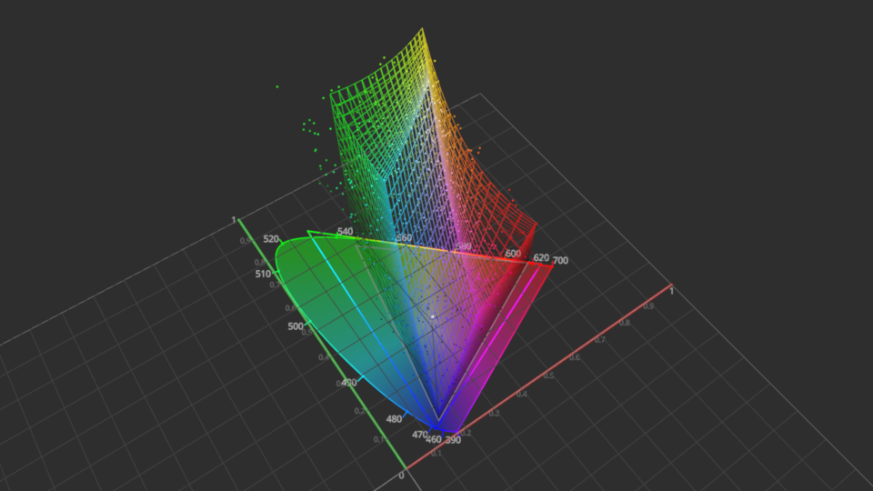

.. sectnum::

Features
--------

Examples
^^^^^^^^

.. code-block:: python

    >>> import colour_visuals
    >>> import numpy as np
    >>> import pygfx as gfx
    >>> from wgpu.gui.auto import WgpuCanvas, run

    >>> canvas = WgpuCanvas(size=(960, 540))
    >>> renderer = gfx.renderers.WgpuRenderer(canvas)
    >>> camera = gfx.PerspectiveCamera(50, 16 / 9)  # pyright: ignore
    >>> controller = gfx.OrbitController(camera)
    >>> controller.register_events(renderer)

    >>> scene = gfx.Scene()
    >>> scene.add(
    ...     gfx.Background(
    ...         None, gfx.BackgroundMaterial(np.array([0.18, 0.18, 0.18]))
    ...     )
    ... )

    >>> visuals = [
    ...     colour_visuals.VisualGrid(size=2),
    ...     colour_visuals.VisualChromaticityDiagramCIE1931(
    ...         kwargs_visual_chromaticity_diagram={"opacity": 0.25}
    ...     ),
    ...     colour_visuals.VisualRGBColourspace2D("ACEScg"),
    ...     colour_visuals.VisualRGBColourspace2D(
    ...         "Display P3", colours=np.array([0.5, 0.5, 0.5])
    ...     ),
    ...     colour_visuals.VisualRGBColourspace3D(
    ...         "Display P3", opacity=0.5, wireframe=True
    ...     ),
    ...     colour_visuals.VisualRGBScatter3D(
    ...         np.random.random([24, 32, 3]), "ACEScg"
    ...     ),
    ... ]

    >>> group = gfx.Group()
    >>> for visual in visuals:
    ...     group.add(visual)
    ...
    >>> scene.add(group)

    >>> camera.local.position = np.array([-0.25, -0.5, 2])
    >>> camera.show_pos(np.array([1 / 3, 1 / 3, 0.4]))

    >>> canvas.request_draw(lambda: renderer.render(scene, camera))
    >>> run()

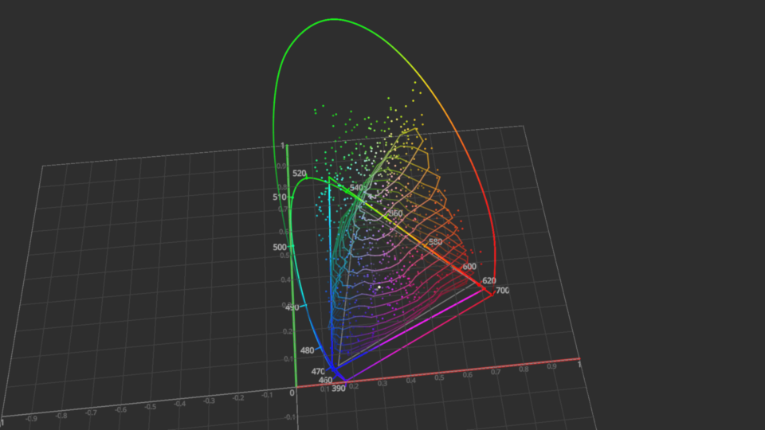

.. code-block:: python

    >>> import colour_visuals
    >>> import numpy as np
    >>> import pygfx as gfx
    >>> from wgpu.gui.auto import WgpuCanvas, run

    >>> canvas = WgpuCanvas(size=(960, 540))
    >>> renderer = gfx.renderers.WgpuRenderer(canvas)
    >>> camera = gfx.PerspectiveCamera(50, 16 / 9)  # pyright: ignore
    >>> controller = gfx.OrbitController(camera)
    >>> controller.register_events(renderer)

    >>> scene = gfx.Scene()
    >>> scene.add(
    ...     gfx.Background(
    ...         None, gfx.BackgroundMaterial(np.array([0.18, 0.18, 0.18]))
    ...     )
    ... )

    >>> visuals = [
    ...     VisualGrid(size=4),
    ...     VisualSpectralLocus3D(model="CIE Lab"),
    ...     VisualPointerGamut3D(
    ...         model="CIE Lab", colours=np.array([1, 0.5, 0])
    ...     ),
    ...     VisualRGBColourspace3D(
    ...         "Display P3",
    ...         model="CIE Lab",
    ...         opacity=0.5,
    ...         wireframe=True,
    ...         segments=8,
    ...     ),
    ...     VisualRGBScatter3D(
    ...         np.random.random([24, 32, 3]), "Display P3", model="CIE Lab"
    ...     ),
    ... ]

    >>> group = gfx.Group()
    >>> for visual in visuals:
    ...     group.add(visual)
    ...
    >>> scene.add(group)

    >>> camera.local.position = np.array([1.5, -1.5, 5])
    >>> camera.show_pos(np.array([0, 0, 0.5]))

    >>> canvas.request_draw(lambda: renderer.render(scene, camera))
    >>> run()

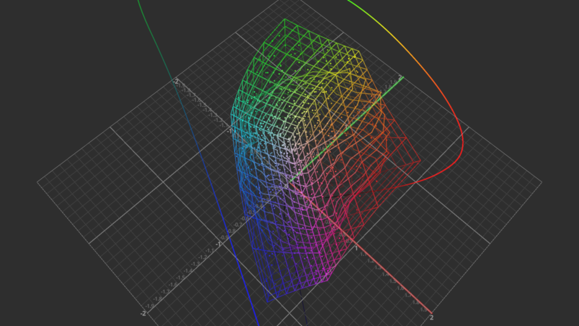

Daylight Locus Visuals
~~~~~~~~~~~~~~~~~~~~~~

.. code-block:: python

    >>> colour_visuals.Plotting_VisualDaylightLocus()

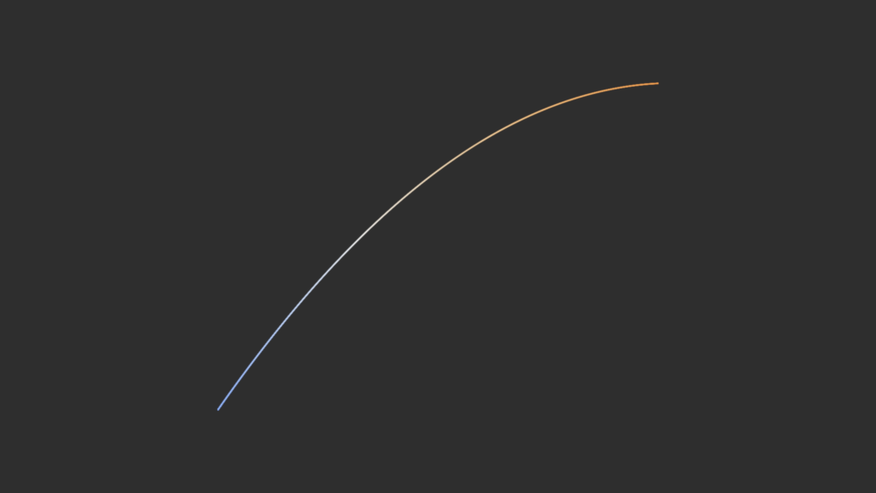

Chromaticity Diagram Visuals
~~~~~~~~~~~~~~~~~~~~~~~~~~~~

.. code-block:: python

    >>> colour_visuals.Plotting_VisualSpectralLocus2D()

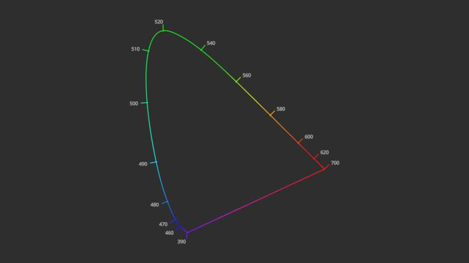

.. code-block:: python

    >>> colour_visuals.VisualChromaticityDiagramCIE1931(
    ...     kwargs_visual_chromaticity_diagram={"opacity": 0.25}
    ... )

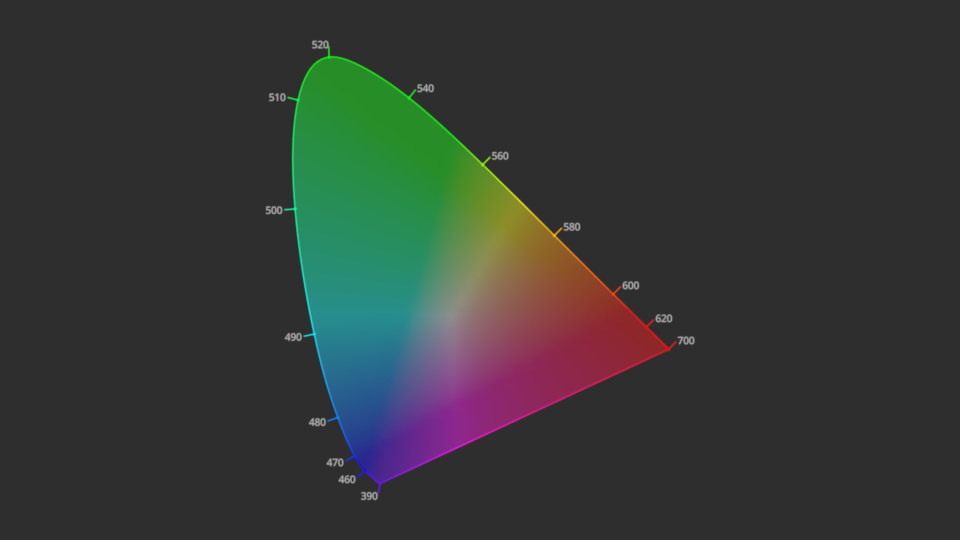

Planckian Locus Visuals
~~~~~~~~~~~~~~~~~~~~~~~

.. code-block:: python

    >>> colour_visuals.VisualPlanckianLocus()

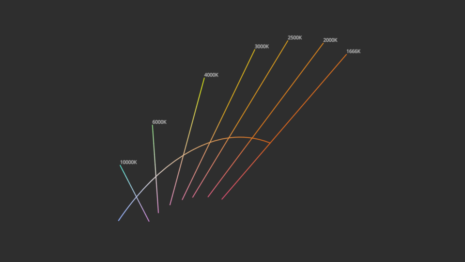

Pointer's Gamut Visuals
~~~~~~~~~~~~~~~~~~~~~~~

.. code-block:: python

    >>> colour_visuals.VisualPointerGamut2D()

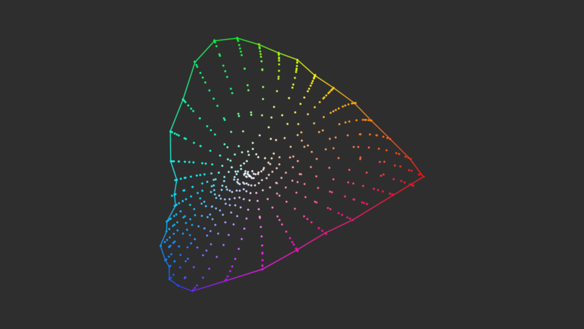

.. code-block:: python

    >>> colour_visuals.VisualPointerGamut3D()

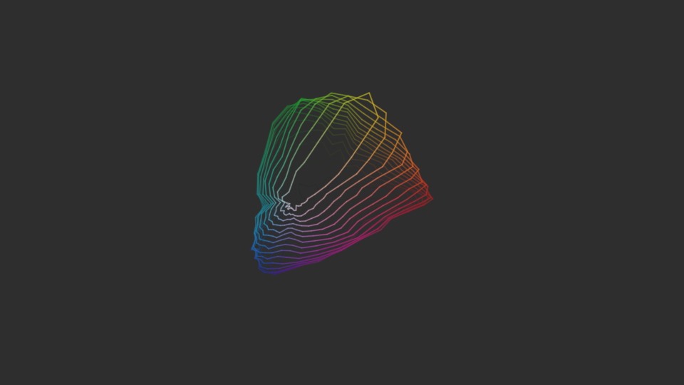

RGB Colourspace Visuals
~~~~~~~~~~~~~~~~~~~~~~~

.. code-block:: python

    >>> colour_visuals.VisualRGBColourspace2D()

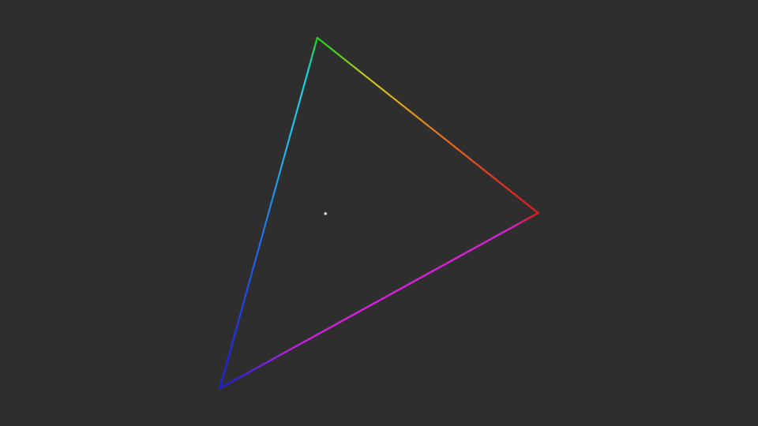

.. code-block:: python

    >>> colour_visuals.VisualRGBColourspace3D()

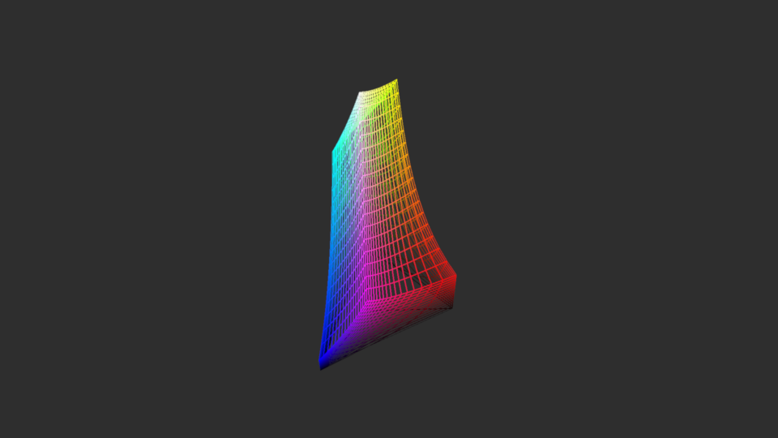

RGB Scatter Visuals
~~~~~~~~~~~~~~~~~~~

.. code-block:: python

    >>> colour_visuals.VisualRGBScatter3D(np.random.random([24, 32, 3]))

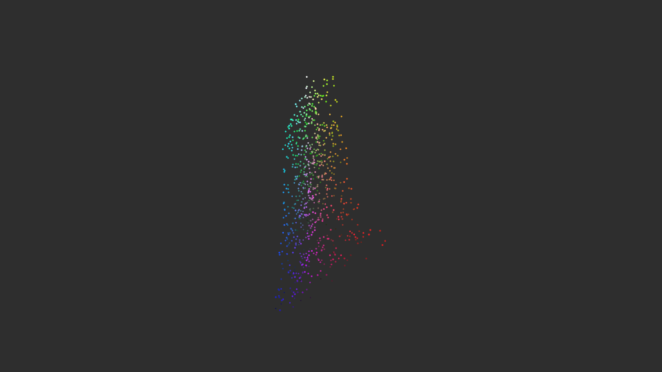

Rösch-MacAdam Visuals
~~~~~~~~~~~~~~~~~~~~~

.. code-block:: python

    >>> colour_visuals.VisualRoschMacAdam()

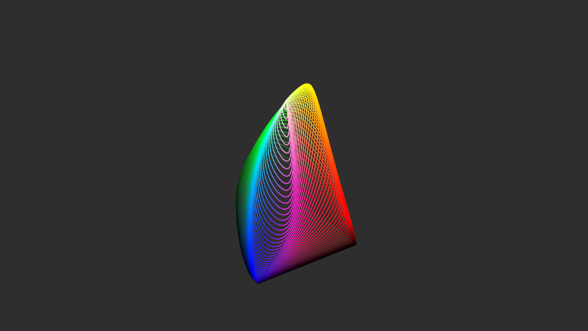

Patterns
~~~~~~~~

.. code-block:: python

    >>> colour_visuals.pattern_hue_swatches()

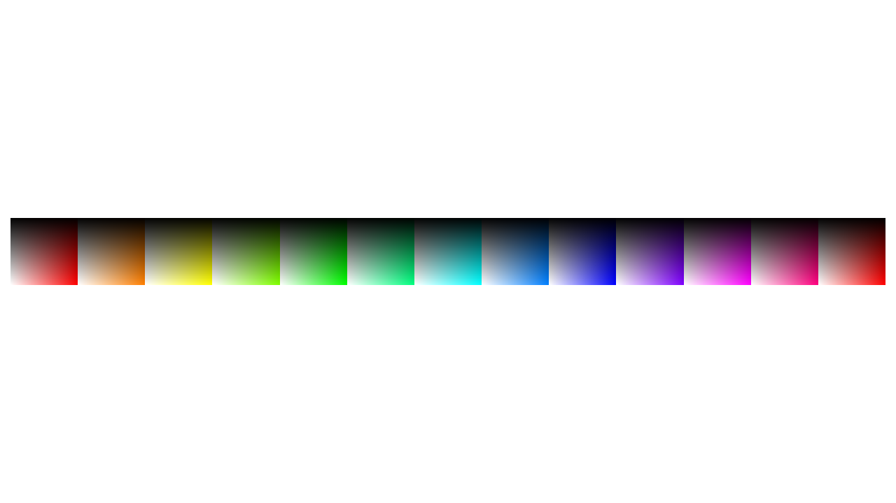

.. code-block:: python

    >>> colour_visuals.pattern_hue_stripes()

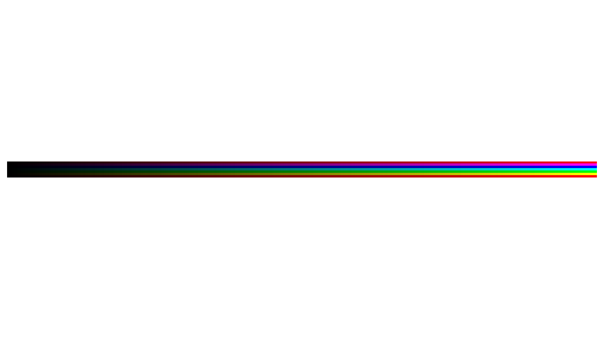

.. code-block:: python

    >>> colour_visuals.pattern_colour_wheel()

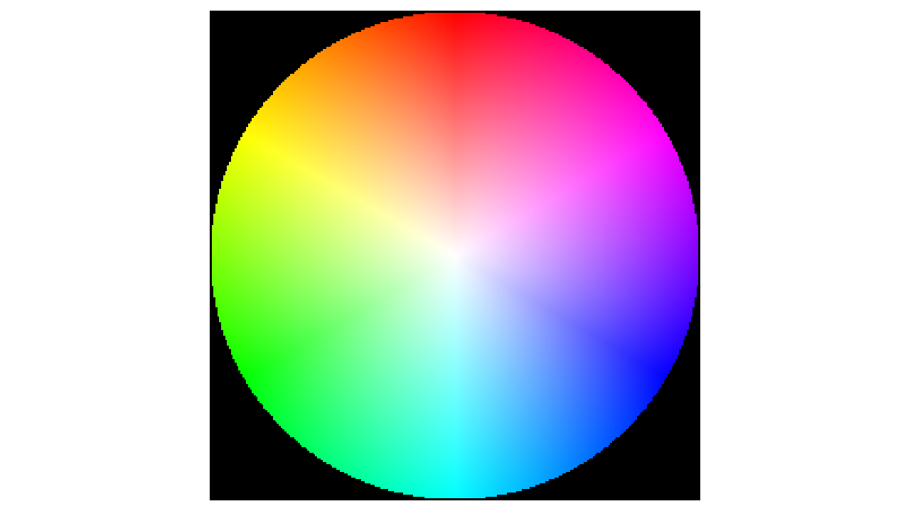

User Guide
----------

.. toctree::
    :maxdepth: 2

    user-guide

API Reference
-------------

.. toctree::
    :maxdepth: 2

    reference

Code of Conduct
---------------

The *Code of Conduct*, adapted from the `Contributor Covenant 1.4 <https://www.contributor-covenant.org/version/1/4/code-of-conduct.html>`__,
is available on the `Code of Conduct <https://www.colour-science.org/code-of-conduct>`__ page.

Contact & Social
----------------

The *Colour Developers* can be reached via different means:

- `Email <mailto:colour-developers@colour-science.org>`__
- `Facebook <https://www.facebook.com/python.colour.science>`__
- `Github Discussions <https://github.com/colour-science/colour-visuals/discussions>`__
- `Gitter <https://gitter.im/colour-science/colour>`__
- `Twitter <https://twitter.com/colour_science>`__

About
-----

| **Colour - Visuals** by Colour Developers
| Copyright 2023 Colour Developers – `colour-developers@colour-science.org <colour-developers@colour-science.org>`__
| This software is released under terms of BSD-3-Clause: https://opensource.org/licenses/BSD-3-Clause
| `https://github.com/colour-science/colour-visuals <https://github.com/colour-science/colour-visuals>`__
